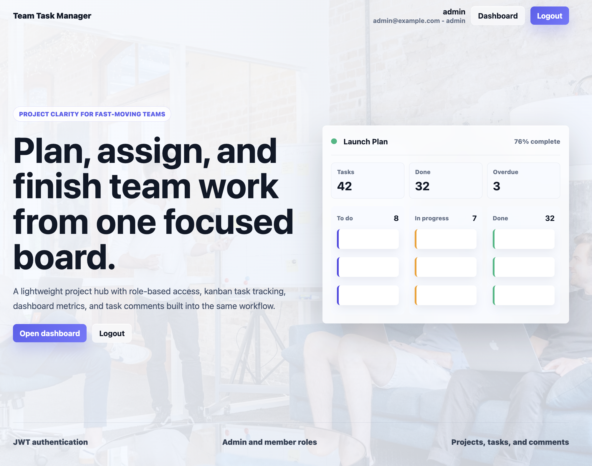
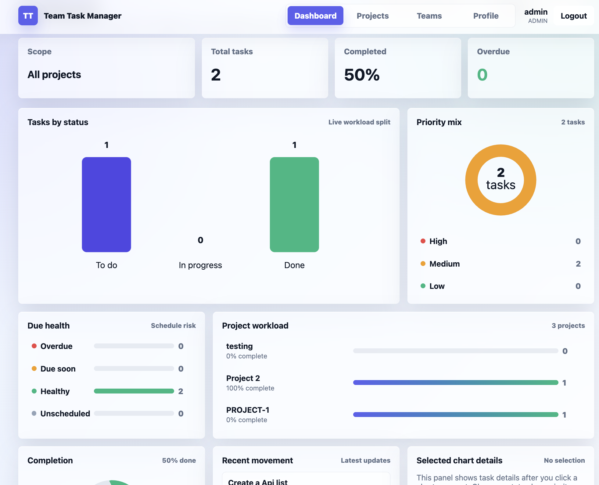
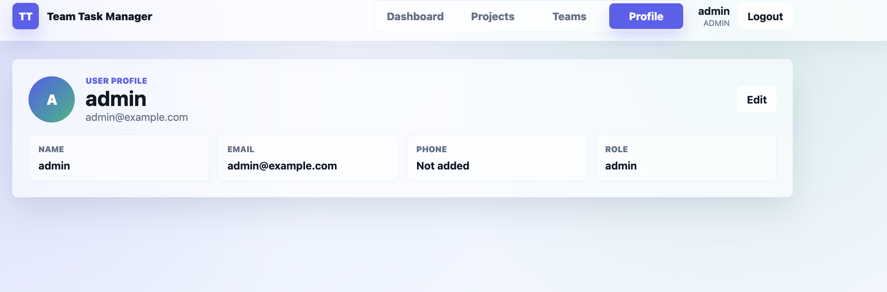
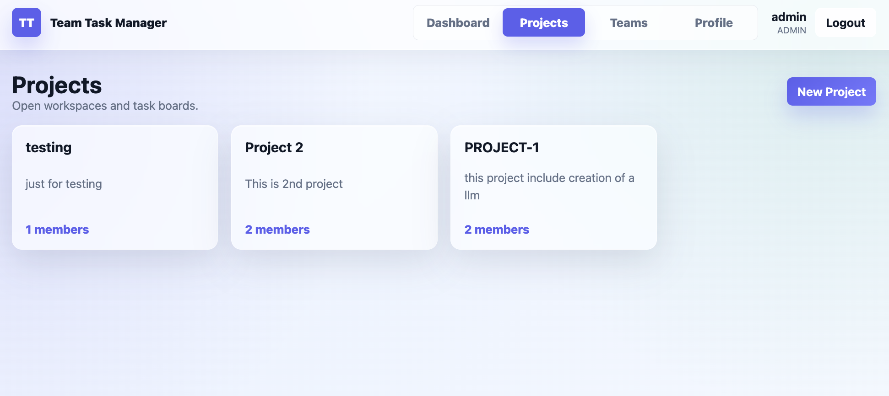
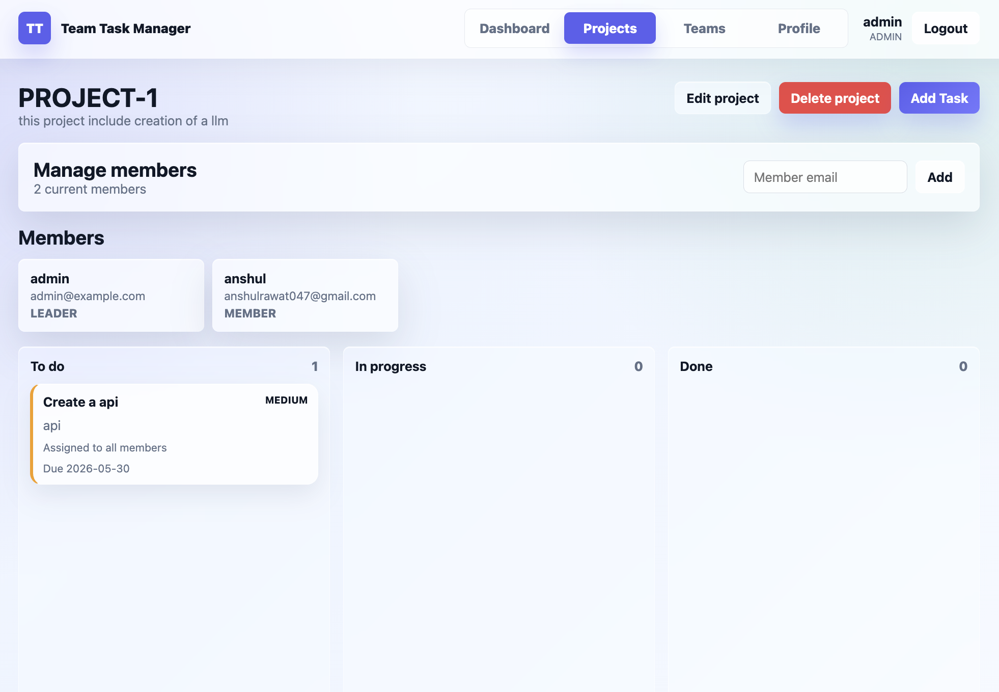
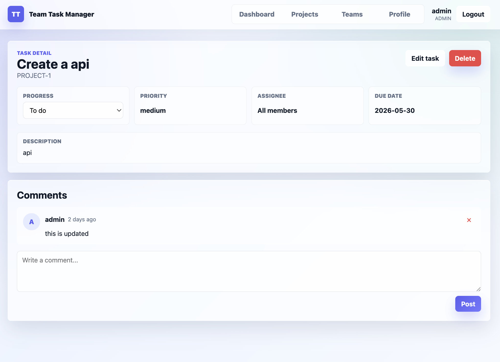
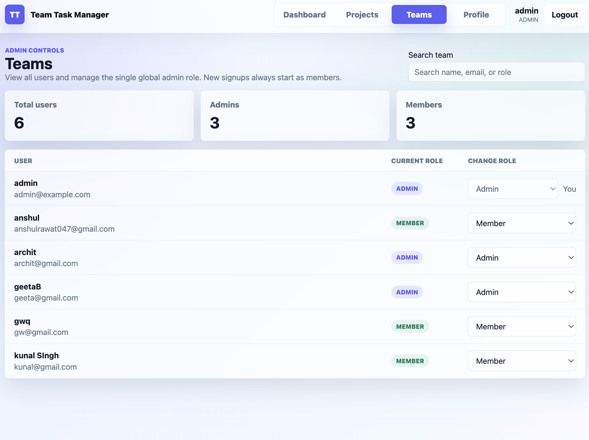

# Team Task Manager

Team Task Manager is a full-stack project management application for small teams. It supports user authentication, admin/member roles, project membership, kanban task tracking, dashboard analytics, and task comments.

## Screenshots

### Landing Page


### Dashboard


### Profile Page


### Projects


### Project Board


### Task Detail and Comments


### Teams Admin Page



## Main Features

- User signup and login with JWT authentication.
- Admin and member roles.
- Every new user starts as a member, except the first signup which bootstraps the first admin.
- Any signed-in user can create a project.
- Project creators become the project leader and are automatically added as project members.
- Users only see projects where they are the leader or have been added as a member.
- Project leaders can add members to their projects.
- Project leaders can edit project details or delete their own projects.
- Project members can view project boards and tasks.
- Project leaders and the global admin can create, update, and delete tasks.
- Members only see tasks assigned to them and can update their own task status.
- Assigning a task to all members creates one tracked task per member.
- Users can post comments on tasks.
- Dashboard charts show project/task analytics from the user's accessible projects.
- Teams page lets the global admin view users and transfer the single admin role.

## Tech Stack

### Backend

- FastAPI
- MongoDB
- Beanie ODM
- Motor
- JWT authentication
- Pydantic schemas

### Frontend

- React 18
- Vite
- TanStack Query
- Axios
- React Router
- Plain CSS
- `@dnd-kit/core` for kanban drag and drop

## Project Structure

```text
backend/
  main.py
  database.py
  config.py
  dependencies.py
  security.py
  seed.py
  models/
  schemas/
  routers/

frontend/
  src/
    api/
    components/
    context/
    pages/
    utils/
  package.json
  vite.config.js
```

## Roles and Permissions

### Member

A member can:

- sign in and view their accessible projects
- create new projects
- become the leader of projects they create
- view tasks in projects where they are a member
- update the status of tasks assigned to them
- post comments on tasks

A member cannot:

- view tasks assigned to other members
- add members to projects they do not lead
- create, fully edit, or delete tasks in projects they do not lead
- manage team roles
- view projects they are not part of

### Project Leader

A project leader is the user who created a project.

A project leader can:

- view and manage their project
- edit the project name and description
- delete their project
- add members to their project
- create tasks in their project
- fully edit and delete tasks in their project
- see each member's status when a task is assigned to all members

### Global Admin

There should be only one global admin.

A global admin can:

- view all projects
- manage all projects
- edit or delete any project
- create, update, and delete tasks in any project
- view the Teams page
- transfer admin access to another user

Important project visibility rule:

Regular users only see projects where they are the project leader or have been added as a member. The global admin can see all projects.

## Project Membership Flow

1. Any signed-in user creates a project.
2. The project creator is saved as the project owner.
3. The project creator is also added to the project members list.
4. The project creator is the project leader.
5. The project leader can edit the project name and description.
6. The project leader can delete the project when it is no longer needed.
7. The project leader can add other users to that project by email.
8. Added users can now see that project in their Projects page and Dashboard.
9. Users who are not added to a project cannot see or open it.

## Task Assignment Flow

1. A project leader or global admin creates a task.
2. If the task is assigned to one member, only that member can see it and update its progress.
3. If the task is assigned to all members, the system creates one copy of the task for each project member.
4. Each member updates only their own copy of the task.
5. The project leader and global admin can see every member's copy, so they can track who is `todo`, `in_progress`, or `done`.

## Admin and Teams Flow

1. Sign in as the global admin.
2. Open the `Teams` page from the top navigation.
3. The page shows all users.
4. Use the role dropdown to change a user from `member` to `admin`.
5. Confirm the transfer.
6. The selected user becomes the only global admin, and the previous admin becomes a member.

If the Teams page does not show users:

- make sure you are logged in as an admin
- restart the backend if the users route was recently added
- confirm exactly one account has `role: "admin"` in MongoDB

## Admin Login

Use this account to access the admin dashboard and Teams page:

```text
Email: admin@example.com
Username: admin
Password: AdminPass123!
```

The admin can sign in with either the email address or username.

## Authentication Flow

1. A user signs up or logs in.
2. The backend returns an access token and refresh token.
3. The frontend stores the refresh token in `localStorage`.
4. The access token is kept in React state.
5. If the access token expires, the frontend uses the refresh token to request a new access token.
6. If refresh fails, the user is logged out.

## Local Backend Setup

Create and activate a virtual environment:

```bash
cd backend
python3.11 -m venv .venv
source .venv/bin/activate
```

Install dependencies:

```bash
pip install -r requirements.txt
```

Create a `.env` file:

```bash
cp .env.example .env
```

Required backend environment variables:

```bash
MONGO_URI=mongodb://localhost:27017/team_task_manager
DATABASE_NAME=team_task_manager
SECRET_KEY=replace-with-a-random-32-byte-hex-string
CORS_ORIGINS=http://localhost:5173
ACCESS_TOKEN_EXPIRE_MINUTES=30
REFRESH_TOKEN_EXPIRE_DAYS=7
```

Start the backend:

```bash
uvicorn main:app --reload
```

Backend API docs are available at:

```text
http://localhost:8000/docs
```

## Local Frontend Setup

Install dependencies:

```bash
cd frontend
npm install
```

Start the frontend:

```bash
VITE_API_URL=http://localhost:8000 npm run dev
```

Open the app:

```text
http://localhost:5173
```

## Creating the First Admin

There are two supported ways to create an admin.

### Option 1: First Signup

If the database has no users, the first user who signs up becomes an admin. Later signups become members.

### Option 2: Seed Script

Use the seed script to create or repair an admin account:

```bash
cd backend
SEED_ADMIN_EMAIL=admin@example.com \
SEED_ADMIN_USERNAME=admin \
SEED_ADMIN_PASSWORD=AdminPass123! \
python seed.py
```

If the user already exists but is a member, the seed script updates that user to admin. Keep one global admin account active for the intended app flow.

## Main API Endpoints

### Auth

- `POST /api/auth/signup`
- `POST /api/auth/login`
- `POST /api/auth/refresh`
- `GET /api/auth/me`

### Users / Teams

- `GET /api/users`
- `PATCH /api/users/{user_id}/role`

These endpoints require admin access.

### Projects

- `GET /api/projects`
- `POST /api/projects`
- `GET /api/projects/{project_id}`
- `PUT /api/projects/{project_id}`
- `DELETE /api/projects/{project_id}`
- `POST /api/projects/{project_id}/members`

### Tasks

- `GET /api/projects/{project_id}/tasks`
- `POST /api/projects/{project_id}/tasks`
- `GET /api/tasks/{task_id}`
- `PUT /api/tasks/{task_id}`
- `DELETE /api/tasks/{task_id}`

### Comments

- `GET /api/tasks/{task_id}/comments`
- `POST /api/tasks/{task_id}/comments`
- `DELETE /api/comments/{comment_id}`

### Dashboard

- `GET /api/dashboard`

## Dashboard Data

The dashboard shows analytics for projects the current user can access.

Charts include:

- total tasks
- completed percentage
- overdue tasks
- tasks by status
- priority mix
- due health
- project workload
- recent task movement

The dashboard also supports project filtering with search and a dropdown.

## MongoDB Atlas Setup

1. Create a free M0 Atlas cluster.
2. Create a database user with read/write access.
3. Add the correct IP address to Network Access.
4. Copy the MongoDB connection string into `MONGO_URI`.
5. Set `DATABASE_NAME=team_task_manager` or your preferred database name.

## Railway Deployment

### Backend Service

- Root directory: `backend`
- Start command:

```bash
uvicorn main:app --host 0.0.0.0 --port $PORT
```

Required environment variables:

- `MONGO_URI`
- `DATABASE_NAME`
- `SECRET_KEY`
- `CORS_ORIGINS`
- `ACCESS_TOKEN_EXPIRE_MINUTES`
- `REFRESH_TOKEN_EXPIRE_DAYS`

### Frontend Service

- Root directory: `frontend`
- Build command:

```bash
npm run build
```

- Start command:

```bash
npx serve dist
```

Required environment variable:

```bash
VITE_API_URL=https://your-backend-url
```

## Common Issues

### Teams page does not show users

- Log in as an admin.
- Restart the backend if the users route was recently added.
- Check that the current user has `role: "admin"` in MongoDB.
- Run the seed script to repair the admin user.

### Admin cannot see a project

The global admin can see all projects. Regular users only see projects where they are the leader or have been added as a member.

### Member cannot manage a project

Members can create their own projects. To manage an existing project, they must be that project's leader or the global admin.

### Frontend cannot connect to backend

- Confirm the backend is running on `http://localhost:8000`.
- Confirm `VITE_API_URL=http://localhost:8000`.
- Confirm `CORS_ORIGINS` includes `http://localhost:5173`.

## Notes

- Access tokens live in React state.
- Refresh tokens live in `localStorage`.
- Project access is membership based.
- Role access is controlled by the backend.
- The frontend hides admin controls for members, but the backend is the final source of truth.
