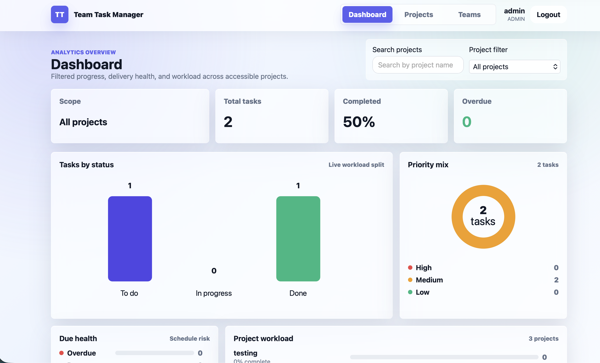
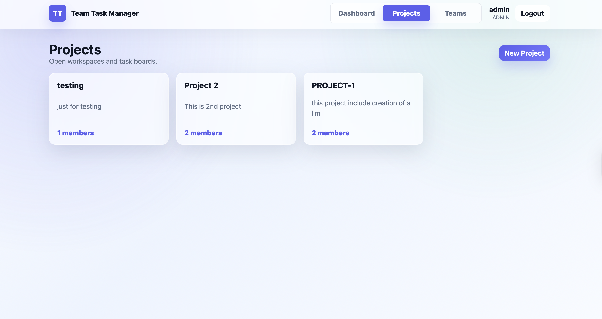
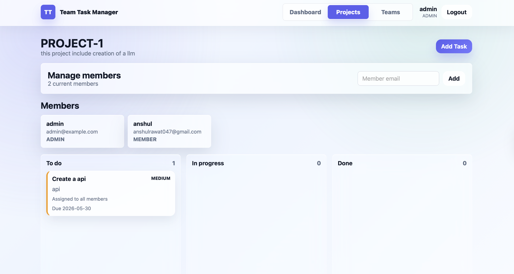
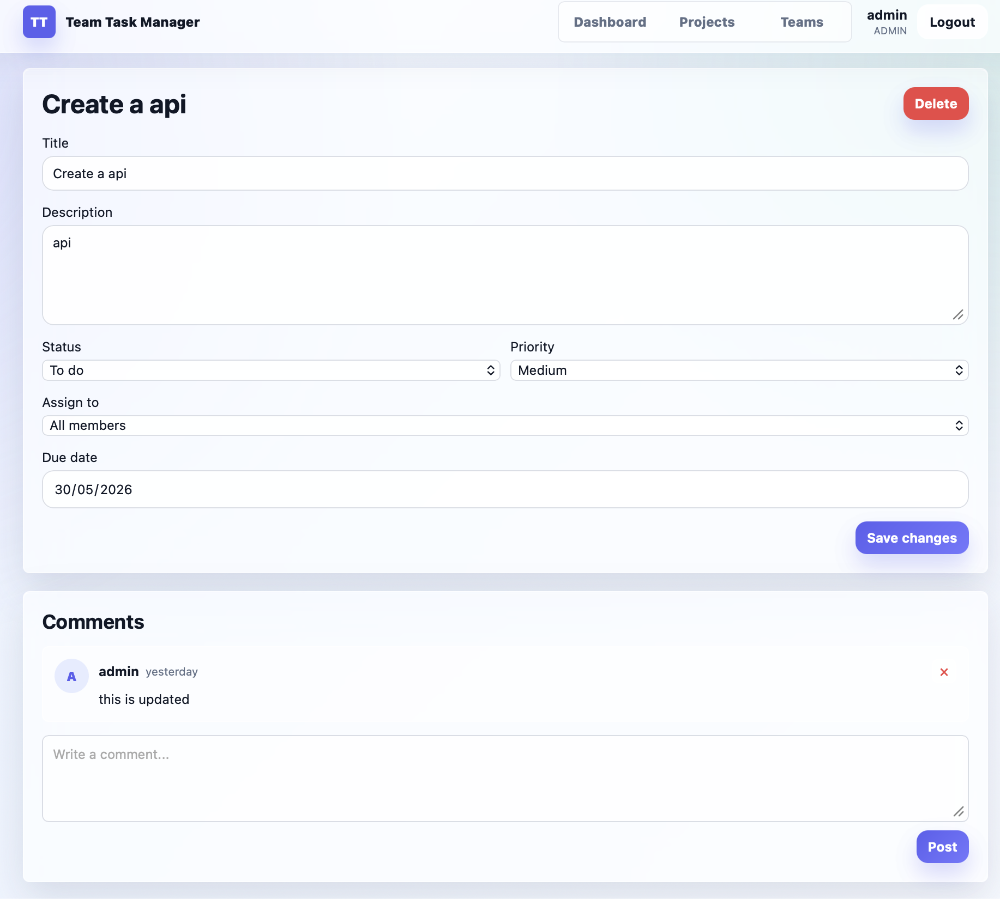
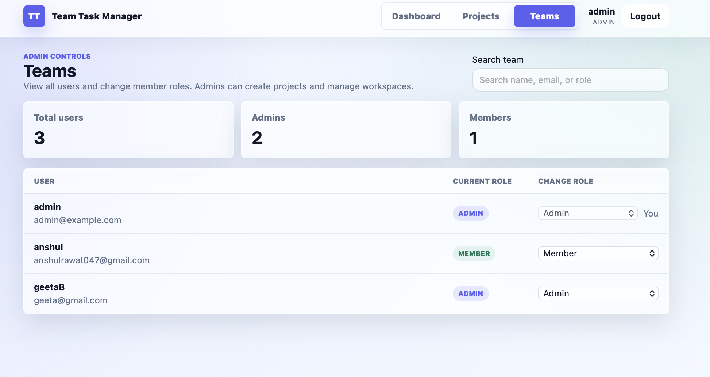

# Team Task Manager

Team Task Manager is a full-stack project management application for small teams. It supports user authentication, admin/member roles, project membership, kanban task tracking, dashboard analytics, and task comments.

## Screenshots

### Landing Page


### Dashboard



### Projects



### Project Board



### Task Detail and Comments



### Teams Admin Page



## Main Features

- User signup and login with JWT authentication.
- Admin and member roles.
- Admins can create projects.
- Project creators are automatically added as project members.
- Users only see projects where they are the owner or have been added as a member.
- Admins can add members to projects they belong to.
- Project members can view project boards and tasks.
- Admins can create, update, and delete tasks.
- Members can update task status.
- Users can post comments on tasks.
- Dashboard charts show project/task analytics from the user's accessible projects.
- Teams page lets admins view users and change a user role from member to admin.

## Tech Stack

### Backend

- FastAPI
- MongoDB
- Beanie ODM
- Motor
- JWT authentication
- Pydantic schemas

### Frontend

- React 18
- Vite
- TanStack Query
- Axios
- React Router
- Plain CSS
- `@dnd-kit/core` for kanban drag and drop

## Project Structure

```text
backend/
  main.py
  database.py
  config.py
  dependencies.py
  security.py
  seed.py
  models/
  schemas/
  routers/

frontend/
  src/
    api/
    components/
    context/
    pages/
    utils/
  package.json
  vite.config.js
```

## Roles and Permissions

### Member

A member can:

- sign in and view their accessible projects
- view tasks in projects where they are a member
- update task status
- post comments on tasks

A member cannot:

- create projects
- add project members
- create or delete tasks
- manage team roles
- view projects they are not part of

### Admin

An admin can:

- create projects
- create tasks inside projects they belong to
- add members to projects they belong to
- update and delete tasks
- view the Teams page
- change another user from member to admin

Important project visibility rule:

Even if a user is an admin, they only see projects where they are the project owner or have been added as a member.

## Project Membership Flow

1. An admin creates a project.
2. The project creator is saved as the project owner.
3. The project creator is also added to the project members list.
4. The admin can add other users to that project by email.
5. Added users can now see that project in their Projects page and Dashboard.
6. Users who are not added to a project cannot see or open it.

## Admin and Teams Flow

1. Sign in as an admin.
2. Open the `Teams` page from the top navigation.
3. The page shows all users.
4. Use the role dropdown to change a user from `member` to `admin`.
5. After that user logs in again, they can create projects.

If the Teams page does not show users:

- make sure you are logged in as an admin
- restart the backend if the users route was recently added
- confirm the account has `role: "admin"` in MongoDB

## Authentication Flow

1. A user signs up or logs in.
2. The backend returns an access token and refresh token.
3. The frontend stores the refresh token in `localStorage`.
4. The access token is kept in React state.
5. If the access token expires, the frontend uses the refresh token to request a new access token.
6. If refresh fails, the user is logged out.

## Local Backend Setup

Create and activate a virtual environment:

```bash
cd backend
python3.11 -m venv .venv
source .venv/bin/activate
```

Install dependencies:

```bash
pip install -r requirements.txt
```

Create a `.env` file:

```bash
cp .env.example .env
```

Required backend environment variables:

```bash
MONGO_URI=mongodb://localhost:27017/team_task_manager
DATABASE_NAME=team_task_manager
SECRET_KEY=replace-with-a-random-32-byte-hex-string
CORS_ORIGINS=http://localhost:5173
ACCESS_TOKEN_EXPIRE_MINUTES=30
REFRESH_TOKEN_EXPIRE_DAYS=7
```

Start the backend:

```bash
uvicorn main:app --reload
```

Backend API docs are available at:

```text
http://localhost:8000/docs
```

## Local Frontend Setup

Install dependencies:

```bash
cd frontend
npm install
```

Start the frontend:

```bash
VITE_API_URL=http://localhost:8000 npm run dev
```

Open the app:

```text
http://localhost:5173
```

## Creating the First Admin

There are two supported ways to create an admin.

### Option 1: First Signup

If the database has no users, the first user who signs up becomes an admin. Later signups become members.

### Option 2: Seed Script

Use the seed script to create or repair an admin account:

```bash
cd backend
SEED_ADMIN_EMAIL=admin@example.com \
SEED_ADMIN_USERNAME=admin \
SEED_ADMIN_PASSWORD=AdminPass123! \
python seed.py
```

If the user already exists but is a member, the seed script updates that user to admin.

## Main API Endpoints

### Auth

- `POST /api/auth/signup`
- `POST /api/auth/login`
- `POST /api/auth/refresh`
- `GET /api/auth/me`

### Users / Teams

- `GET /api/users`
- `PATCH /api/users/{user_id}/role`

These endpoints require admin access.

### Projects

- `GET /api/projects`
- `POST /api/projects`
- `GET /api/projects/{project_id}`
- `PUT /api/projects/{project_id}`
- `DELETE /api/projects/{project_id}`
- `POST /api/projects/{project_id}/members`

### Tasks

- `GET /api/projects/{project_id}/tasks`
- `POST /api/projects/{project_id}/tasks`
- `GET /api/tasks/{task_id}`
- `PUT /api/tasks/{task_id}`
- `DELETE /api/tasks/{task_id}`

### Comments

- `GET /api/tasks/{task_id}/comments`
- `POST /api/tasks/{task_id}/comments`
- `DELETE /api/comments/{comment_id}`

### Dashboard

- `GET /api/dashboard`

## Dashboard Data

The dashboard shows analytics for projects the current user can access.

Charts include:

- total tasks
- completed percentage
- overdue tasks
- tasks by status
- priority mix
- due health
- project workload
- recent task movement

The dashboard also supports project filtering with search and a dropdown.

## MongoDB Atlas Setup

1. Create a free M0 Atlas cluster.
2. Create a database user with read/write access.
3. Add the correct IP address to Network Access.
4. Copy the MongoDB connection string into `MONGO_URI`.
5. Set `DATABASE_NAME=team_task_manager` or your preferred database name.

## Railway Deployment

### Backend Service

- Root directory: `backend`
- Start command:

```bash
uvicorn main:app --host 0.0.0.0 --port $PORT
```

Required environment variables:

- `MONGO_URI`
- `DATABASE_NAME`
- `SECRET_KEY`
- `CORS_ORIGINS`
- `ACCESS_TOKEN_EXPIRE_MINUTES`
- `REFRESH_TOKEN_EXPIRE_DAYS`

### Frontend Service

- Root directory: `frontend`
- Build command:

```bash
npm run build
```

- Start command:

```bash
npx serve dist
```

Required environment variable:

```bash
VITE_API_URL=https://your-backend-url
```

## Common Issues

### Teams page does not show users

- Log in as an admin.
- Restart the backend if the users route was recently added.
- Check that the current user has `role: "admin"` in MongoDB.
- Run the seed script to repair the admin user.

### Admin cannot see a project

Admins only see projects where they are the owner or have been added as a member. Add the admin to the project members list if they need access.

### Member cannot create a project

Only admins can create projects. Promote the user from the Teams page.

### Frontend cannot connect to backend

- Confirm the backend is running on `http://localhost:8000`.
- Confirm `VITE_API_URL=http://localhost:8000`.
- Confirm `CORS_ORIGINS` includes `http://localhost:5173`.

## Notes

- Access tokens live in React state.
- Refresh tokens live in `localStorage`.
- Project access is membership based.
- Role access is controlled by the backend.
- The frontend hides admin controls for members, but the backend is the final source of truth.
